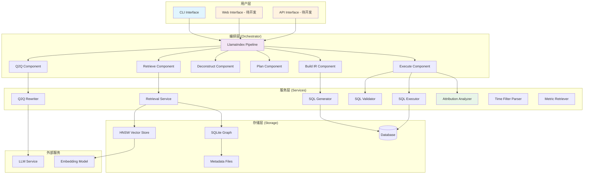
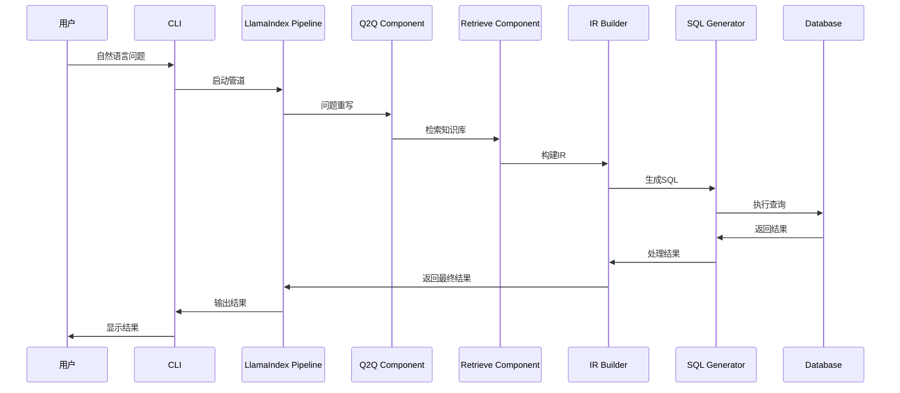
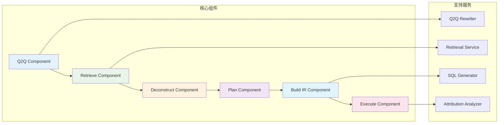
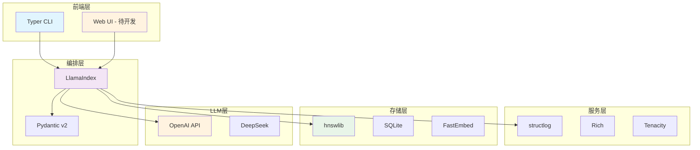
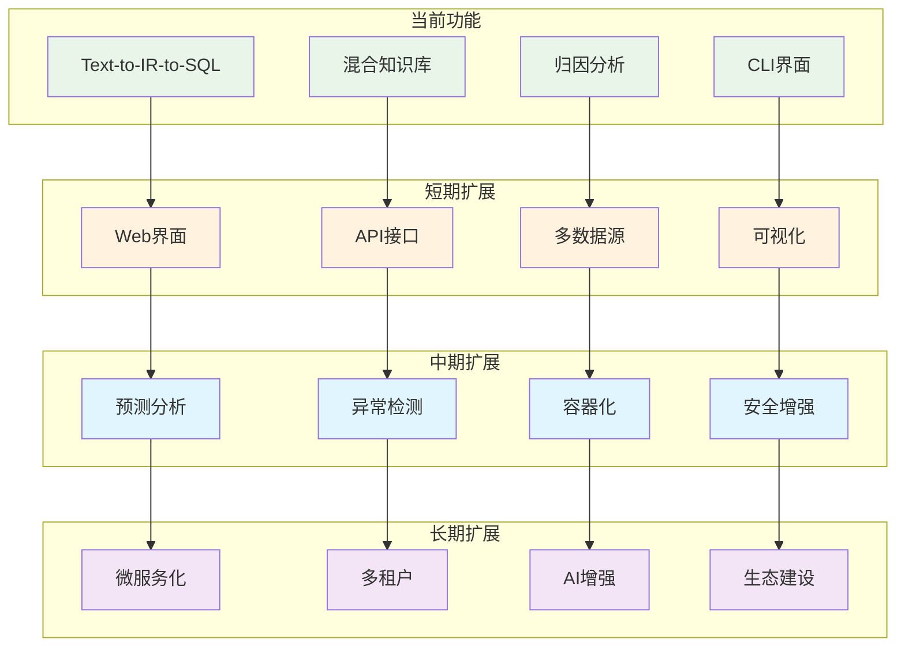
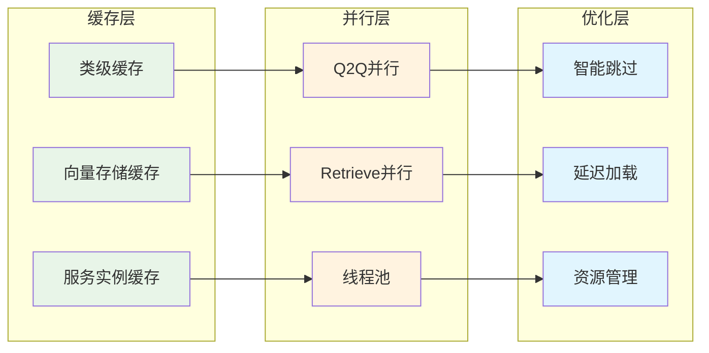
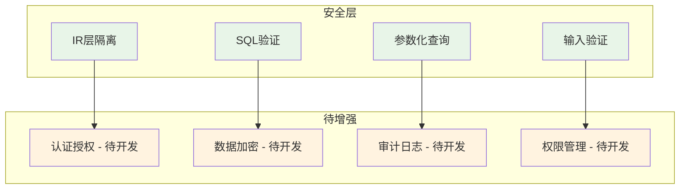
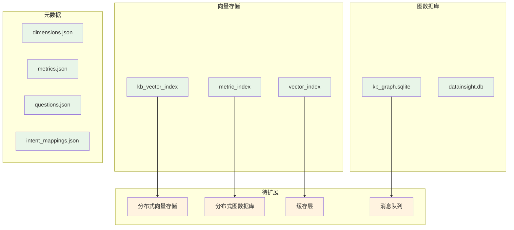

# DataInsight Agent 项目架构图

## 🏗️ 整体架构图

## 🔄 数据流图

## 🧩 组件关系图

## 📊 技术栈图

## 🚀 扩展方向图

## 📈 性能优化图

## 🔒 安全架构图

## 📊 数据存储架构图

## 🎯 总结

这些架构图展示了DataInsight Agent的：

1. **当前状态**: 完整的核心架构和功能
2. **技术栈**: 现代化的技术选型
3. **扩展方向**: 清晰的扩展路径
4. **性能优化**: 多层次的优化策略
5. **安全设计**: 安全优先的设计理念
6. **存储架构**: 灵活的存储方案

通过这些图表，可以清晰地看到项目的现状和未来的发展方向。
